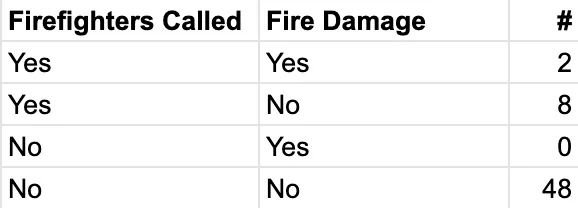
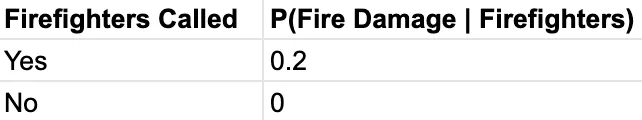
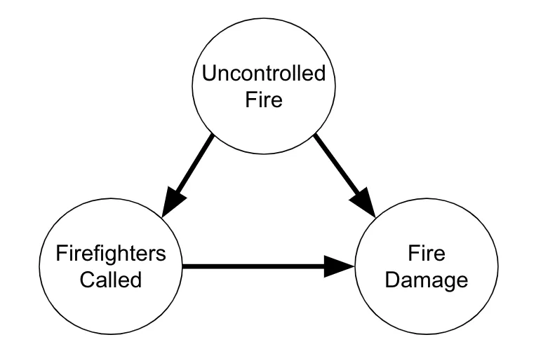
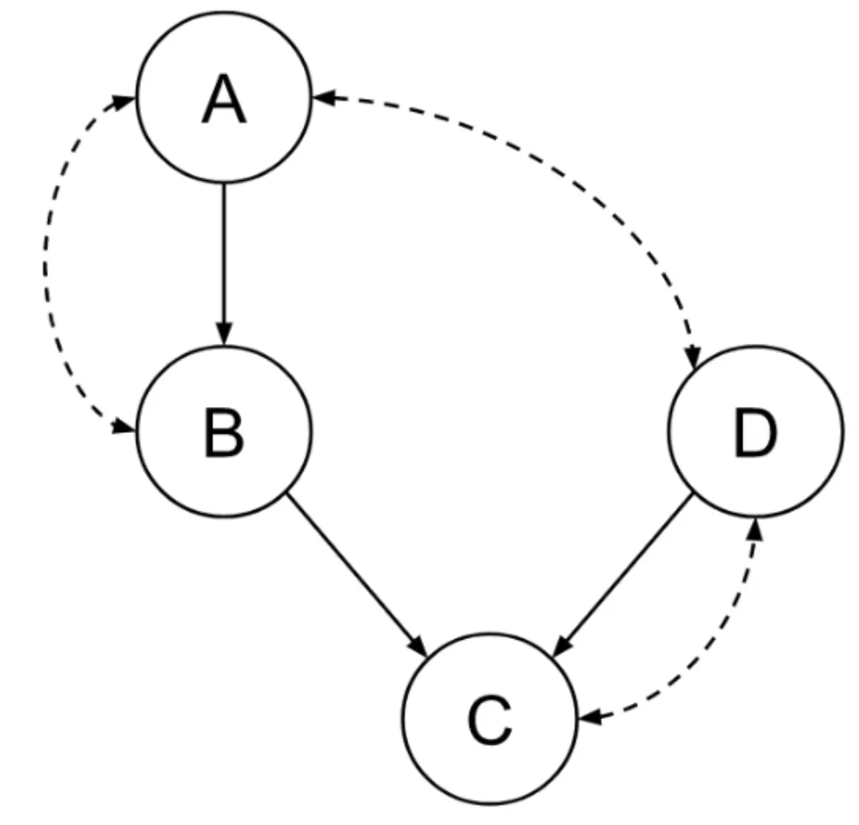
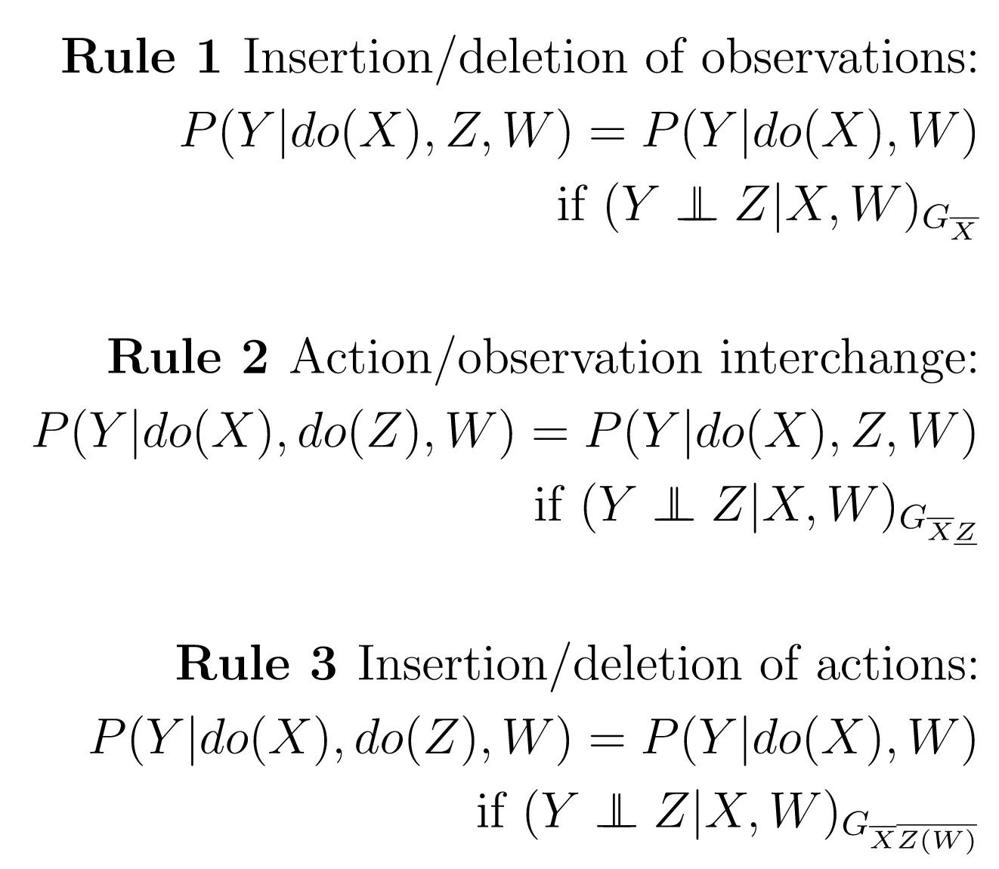
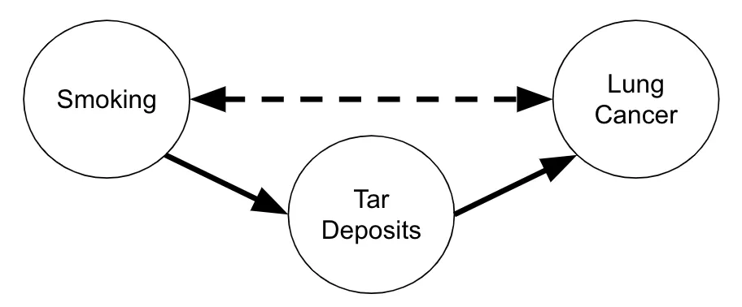

import Layout from "../../components/MDXLayout"
export default Layout

import BlogTable from "../../components/BlogTable"

Randomized control trials are the gold standard of causality, but they are not always possible, whether because of cost, ethical concerns, or other issues. Causal inference is about characterizing what causal relationships exist in a dataset with access to only observational data — i.e., without the ability to run experiments. In this article, I’m going to outline a framework for causal inference developed by [Sharma (2020)](https://arxiv.org/pdf/2011.04216.pdf). Based on Judea Pearl’s theory of Structural Causal Models, this framework breaks the process into four steps, making it easier to understand.

I think it’s important to not shy away from the math when using any statistical model, but understanding is especially important in causal inference. I’m going to spend some time digging into how the math works, and for this I’m going to assume college-level understanding of the sum and product rules, the concepts of joint and conditional distribution, and the notion of parametric modeling.

# Causal Inference vs Predictive Inference
Traditional machine learning is all about predictive inference. This is very different from causal inference because predictive models look at the world as it exists on its own, while causal inference tries to guess how the world would respond to an outside intervention.

To explain the difference here, I’ll use the example of predicting which houses will in a neighborhood will experience damage from a house fire. Consider the following dataset.



We can see that in this dataset, the fire fighters are extremely effective. When they are called, they are able to prevent fire damage in 80% of cases. However, if we trained a machine learning model to predict fire damage from this dataset, it would see that fire damage is only sustained in cases where the firefighters were called. Therefore, it would record the fact that in the dataset, if the fire fighters are called, this actually increases the chances of fire damage for the house. Although the model is good for prediction, it would be catastrophic to use it as the basis for policy. We can’t reduce fire damage by disbanding the firefighters!



So, what’s going on here? There are actually two problems with using an out of the box machine learning model to answer a question like this.

**First**, the machine learning model doesn’t have an understanding of how the variables in the model are causally related. As humans, we know that people only call the firefighters if there is an uncontrolled fire, but this is also the only way a house can sustain fire damage. So, the two variables are confounded by an unobserved, third variable.

We could represent this knowledge using a directed acyclic graph (or DAG), as shown below. The nodes represent variables in the model, while the edges represent causal relationships. An uncontrolled fire has a direct effect on both whether the firefighters are called and whether there is fire damage. Meanwhile, calling the firefighters has a direct effect to decrease the probability of fire damage. (Edges can represent both positive and negative effects.)



The question of how an intervention (like disbanding the fire fighters) would affect a distribution is a causal question. And, with observational data, no causality in = no causality out. We have to create a model of which variables exert direct causal influence on which other variables if we want to measure the size of these effects. If we represent these assumptions using a graph like above, we call it a causal graphical model.

**Second**, the machine learning model isn’t even answering the right question. In general machine learning models approximate probability expressions of the form $P(Y | X)$ — conditional probability distributions. Essentially, given that a unit has covariate values X, what are the probabilities of various labels Y? However, to evaluate the likely results of an intervention, we need to approximate the interventional distribution, denoted by $P(Y | do(X))$.

The term behind the conditioning bar is a do-operator. It is a special operator which signifies that we are intervening on X rather than allowing it to be set “by nature.” To apply this to the firefighter example, we know that in our dataset, the “Firefighters Called” variable is determined by the “Uncontrolled Fire” variable. When we condition on $do(\text{Firefighters Called})$, we are saying that we want to consider an alternate world where instead of this mechanism controlling the variable, it will be set by some other mechanism (the intervention) unrelated to the other variables in the model.

Any interesting intervention will almost by definition change the joint distribution of the data $P(Y, X)$, and so insights we gained by modeling this distribution may or may not be applicable. In general, $P(Y | X) \ne P(y | do(X))$.

This brings us to the first of the four stages of causal inference, modeling.

# Stage 1: Modeling
The goal of the modeling stage is to build a build a causal graphical model of the relationships in the data, and then express interesting questions (causal estimands) in the language of do-operators.

Causal graphs have three elements: nodes (representing observed variables), directed edges (representing causality) and bidirected edges (representing confounding). Here is an example that uses all three of these kinds of elements.



In this graph, we can see that the following pairs of variables are confounded: $A ⇔ B$, $A ⇔ D$, and $D ⇔ C$. Confounding here represents the idea that there is an unobserved variable that influences both of them, meaning that if we see an association, we can’t be sure whether it results from this influence of this unobserved variable.

To model our question, we use the do-operator. There are ways to express many of the questions we might want to ask in terms of probability expressions using do-operators. For example, the average treatment effect (or $ATE$) has the following form. Here, $X$ represents treatment, while $Y$ represents outcome.

$$
ATE = E[P(Y | \text{do}(X = \text{True})) - P(Y | \text{do}(X = \text{False}))]
$$

This formula essentially asks what the average difference in outcome would be between a random unit which was experimentally assigned treatment and one which was assigned control.

# Stage 2: Identification

The second stage is where the real magic of causal inference happens. In this stage, we translate the causal estimand (has do-operators) into a statistical estimand (no do-operators.) We do this by finding a mathematical relationship between the question we want to answer and the joint probability distribution of the variables.

On a theoretical level, this is accomplished with the help of the do-calculus. These are a set of algebraic properties of do-operators which allow us to manipulate do-expressions. Using the rules of the do-calculus and the properties of the causal graphical model, you can transform any causal estimand into a statistical estimand or prove that this is impossible.

I will include the rules here so you can get an idea of what they are like, but I won’t go into them in depth because you will rarely be applying them by hand. Algorithms exist which can perform identification automatically, such as my open source library, [pqp](https://leo-ware.github.io/pqp/).



To get an idea of what this might look like, consider the following causal graphical model. We want to assess the impact of smoking on lung cancer, but we suspect that they may be confounded by a common cause (lifestyle factors, genetics etc.) If this were all we had, we would be unable to estimate this effect. However, we are also willing to assume that the mechanism by which smoking increases this risk is by impacting a mediating value: the level of tar deposits in the patient’s lungs.



This is an example of the front-door model, a famous graphical model where identification is possible. We can use pqp to identify the interventional distribution $P(cancer | do(smoking))$.

```python
from pqp.identification import Graph, ATE
from pqp.symbols import make_vars, P, do

# we'll use shortened variable names
#    S = smoking
#    T = tar deposits
#    C = lung cancer

S, T, C = make_vars("STC")

model = Graph([
    T <= S,
    C <= T,
    S & C   # indicates possible confounding
])

causal_estimand = P(C, given=do(S))

model.identify(causal_estimand)
```

And, we arrive at a formula for the interventional distribution in terms of the joint distribution:

$$
\sum_{T} \big({\sum_{S} \big({P(T, C, S) P(S) \over P(T, S)}\big) P(T, S) \over P(S)}\big)
$$

From this, we can derive an abstract estimator for the average treatment effect. This formula might seem a little intimidating, but you shouldn’t worry. The computers will handle the dirty work later on.

$$
ATE = E_{C} \big[\sum_{T} \big({\sum_{S} \big({P(T, C, S) P(S) \over P(T, S)}\big) P(T, S = 1) \over P(S = 1)}\big)\big] - E_{C} \big[\sum_{T} \big({\sum_{S} \big({P(T, C, S) P(S) \over P(T, S)}\big) P(T, S = 0) \over P(S = 0)}\big)\big]
$$

Identification is a complicated topic, and we’ve just touched the surface here. If you want to learn more about the theory behind identification, you should check out my four-part explainer here.

# Stage 3: Estimation

Once we possess an abstract estimator, the next step is to estimate the size of the effect using a dataset. This will involve first modeling the joint distribution, usually with a parametric model, and then using this model to evaluate the statistical estimand. Computational evaluation of the estimand can be quite costly, and the evaluation strategy will often impact the choice of parametric model.

The primary challenge of estimation is that causal estimands contain nested sums. The cost of evaluating will grow exponentially in the depth of the nested sum. In this way, causal inference faces similar implementation challenges to Bayesian statistics. There are a number of approaches to this problem:

- **Brute Force**: for small number of variables, the estimand can be evaluated explicitly. This is compatible with any model of the joint distribution.
- **Assume Linearity**: if we are willing to assume that all effects in the model are linear with gaussian error, efficient algorithms exist for computing effect sizes. This is also known as LSEM.
- **Cleverness**: a number of other estimation strategies have been developed that rely on either sampling techniques or influence functions. These are quite technical though, so I will not go into them.

You can learn more about how to use estimation algorithms in pqp in the [documentation](https://leo-ware.github.io/pqp/index.html).

# Stage 4: Robustness Checks

Note that the estimation stage is the first time we have introduced anyparametric assumptions. One of the advantages to the four-stage framework is that causal and parametric assumptions remain modular. A single parametric model of the joint distribution can be used to evaluate effect estimates under a variety of causal modeling assumptions, for example as a robustness test. A single causal model can be used across multiple models, meaning it can be reused across datasets where sampling distributions vary. This modularity in the system is the basis for most robustness checks.

There are a number of kinds of robustness checks we may want to perform.

- **Parametric Assumptions**: We can apply standard statistical techniques to evaluate the robustness of our parametric assumptions. For example, we can inspect the standard errors of linear models to determine closeness of fit.
- **Causal Modeling Assumptions**: the possibility of unmeasured confounders between treatment and control is what keeps causal inference scientists up at night. One way to test for robustness to an error in causal modeling is to calculuate a lower bound on the strength of confounding that would be required to qualitatively change a result.
- **Bootstrapping**: in order to quantify the statistical significance of results, it is often easiest to use bootstrapping. This relies on random repeated resampling of the dataset to produce a distribution around a point estimate.